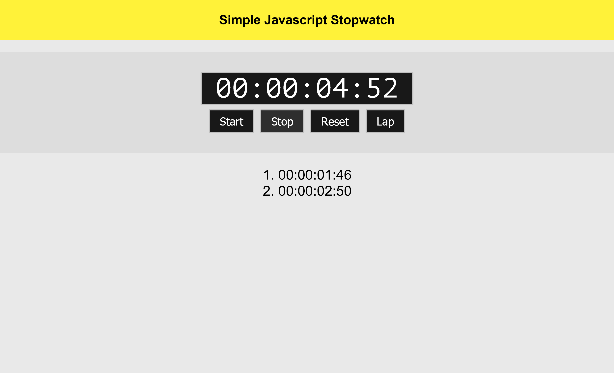

# Simple Javascript Stopwatch

I think that's the longest javascript code i've ever written, 139 lines. I managed to make a working stopwatch using only Vanilla Javascript 
(i don't know how to use frameworks yet). By doing this i learned how to used Intervals, and add HTML Elements with JS (for the laps). Feel free to download the project and launch the index.html file to test it for yourself.

##Preview##

